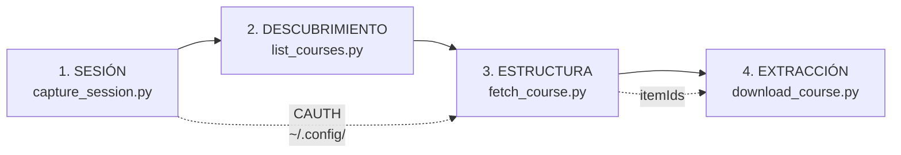

# ARCHITECTURE — cómo se extrae información de Coursera

Documento de arquitectura y método. El recon crudo del portal (endpoints,
gotchas, estado vivo/muerto) vive aparte en [`RESEARCH.md`](RESEARCH.md).

Clasificación según el framework de `klipso_reverse`: **Tipo B** — login por
formulario + cookie de sesión. Referencia más cercana: `sunat-cli`.

---

## 1. El modelo mental: Coursera es una API, no una web

Coursera sirve una SPA que se pinta llamando a su propia API interna
(internamente "Naptime"). Todo lo que ves en pantalla —temario, videos,
subtítulos— ya viajó como JSON antes de renderizarse.

Consecuencia de diseño: **no se scrapea HTML**. Se pide el mismo JSON que pide
el frontend. Es más estable, más rápido y no se rompe con cada rediseño.

Toda respuesta comparte un envelope:

```
{
  "elements": [ ... ],   // lo que pediste
  "paging":   { ... },   // cursor
  "linked":   { ... }    // entidades relacionadas, por tipo
}
```

`linked` es donde vive casi todo. Un curso llega como tres listas planas
—módulos, lecciones, items— más los IDs que las cosen. El árbol no viene
armado: **hay que reconstruirlo por IDs**. Eso es `index_linked()` +
`build_plan()` en el código.

---

## 2. Pipeline de 4 etapas



| # | Etapa | Entrada | Salida | Por qué existe separada |
|---|---|---|---|---|
| 1 | Sesión | login humano | cookie `CAUTH` verificada | Es lo único que necesita un humano. Aislarlo permite automatizar el resto |
| 2 | Descubrimiento | `CAUTH` | slugs de tus cursos | Sin esto hay que copiar URLs a mano |
| 3 | Estructura | slug | árbol + `itemId`s | Los `itemId` son la llave de todo lo demás |
| 4 | Extracción | `itemId`s | `.vtt` (+ `.mp4`) | La única etapa que escribe a disco |

`probe_endpoints.py` es ortogonal: no es parte del pipeline, es el **diagnóstico**.
Se corre cuando algo se rompe para saber qué ruta murió.

---

## 3. Modelo de autenticación

Una sola cookie: `CAUTH` (~601 chars, dominio `.coursera.org`).

### Por qué el login es manual

Automatizar el tipeo de credenciales dispara CAPTCHA. Es la causa de muerte
documentada de `coursera-download-with-selenium`. El patrón que sí funciona
—**browser handoff**— invierte el problema:

1. Playwright abre un Chromium **real y visible**
2. La persona se loguea; el script no toca las credenciales
3. El script poléa `context.cookies()` hasta que aparece `CAUTH`
4. Verifica el token contra un endpoint real
5. Lo guarda fuera del repo, en `~/.config/coursera_recon/`

Desde el lado de Coursera esto es un humano logueándose en un navegador — que
es exactamente lo que es. No hay nada que detectar.

El perfil del navegador persiste, así que la segunda captura es instantánea.

### Por qué el paso 4 no es opcional

Capturar una cookie no prueba que sirva. Todos los downloaders muertos capturan;
ninguno verifica. Por eso fallan cuarenta minutos después con un 403 críptico.
Acá la verificación golpea 4 endpoints y pasa si **alguno** devuelve JSON —
gatear contra uno solo da falso negativo cuando justo ese está deprecado.

---

## 4. La decisión de diseño principal: transcripts-first

Un curso de 18 lecciones pesa varios GB en mp4 y ~130 KB en `.vtt`.

Si el objetivo es resumir, generar flashcards o montar un RAG, **el mp4 no
aporta señal que el transcript no tenga**. Es 10.000× el peso por 0× el valor.

Por eso el default baja solo subtítulos y estructura. El video es opt-in con
`--videos`. La decisión se puede revertir por flag, pero el default empuja
hacia lo barato.

---

## 5. Por qué mueren los downloaders de Coursera

Todos los proyectos públicos que probamos están muertos o casi. La causa no es
anti-bot: es **una constante desactualizada**.

`coursera-dl` (el más popular) murió porque Coursera deprecó
`onDemandCourseMaterials.v1`. El código seguía siendo correcto; la ruta ya no
existía. Son ~200 líneas de HTTP y un string obsoleto.

Mitigación adoptada acá: **las rutas viven en [`endpoints.json`](endpoints.json),
no en el código**. Cuando Coursera deprecie la `.v2`, el arreglo es una línea
de datos, no un refactor. Es la diferencia entre deuda y diseño.

Corolario operativo: si algo falla, correr `probe_endpoints.py` **antes** de
tocar lógica. Dice en 10 segundos si el problema es la ruta o la sesión.

---

## 6. Los tres errores que cuestan horas

Documentados en detalle en `RESEARCH.md`. En orden de crueldad:

**1. `200 OK` con HTML no es un error de auth.** Sin `Accept: application/json`,
Coursera negocia contenido y devuelve el HTML de la SPA con status 200. Parece
sesión inválida y no lo es. Un 401/403 sí sería sesión inválida. Distinguir
esos dos casos es la diferencia entre un fix de un header y una tarde perdida.

**2. Las URLs de media expiran.** Subtítulos firmados con `expiry`+`hmac`,
video con CloudFront `Expires`+`Signature`. No se pueden cachear y descargar
después: hay que pedir y bajar en la misma pasada.

**3. Las formas anidadas mienten en silencio.** `typeName` vive en
`contentSummary.typeName`, no en la raíz. `byResolution["1080p"]` es un dict de
formatos, no una URL. Pedirlos mal devuelve `None` sin avisar.

---

## 7. Cómo portar esto a otra plataforma

El método, no el código:

1. **Clasificar el target.** ¿Cookie de sesión, Bearer, OAuth, Server Actions?
   Define todo lo demás.
2. **Abrir DevTools antes que el editor.** Mirar qué pide la web al hacer la
   acción que querés automatizar. Si hay API JSON, no se scrapea HTML.
3. **Resolver la sesión primero, y aislarla.** Es la única parte que necesita
   un humano.
4. **Sondear endpoints antes de construir.** Una tabla vivo/muerto cuesta
   minutos y evita construir sobre una ruta deprecada.
5. **Verificar con datos reales, no con un 200.** Un status code no es una
   demo.
6. **Escribir el RESEARCH antes que el código**, y no borrarlo nunca. Los
   gotchas son el activo; el código es reemplazable.

Los pasos 4 y 5 son los que se saltan los repos muertos.

---

## 8. Alcance y límites

Diseñado para **cursos propios con enrollment activo**, para uso personal.

- No evade DRM: no hay DRM que evadir. Coursera ya ofrece descarga oficial
  por lección; esto automatiza el tedio de hacerlo 18 veces.
- No evade paywall: sin enrollment, la API no devuelve el material. Coursera
  eliminó el acceso de auditoría en julio de 2025.
- Hay una pausa deliberada entre requests. No es paranoia: es no comportarse
  como un scraper agresivo contra un servicio del que sos cliente.
- El material descargado no se redistribuye. El `.gitignore` bloquea
  `downloads/`, `*.vtt`, `*.mp4` y los árboles de curso para que no se filtren
  en un commit distraído.
