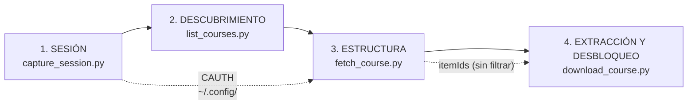

# ARCHITECTURE — cómo se extrae y desbloquea información de Coursera

Documento de arquitectura y método. El recon crudo del portal (endpoints,
gotchas, estado vivo/muerto) vive aparte en [`RESEARCH.md`](RESEARCH.md).

Clasificación según el framework de `klipso_reverse`: **Tipo B** — login por
formulario + cookie de sesión. Referencia más cercana: `sunat-cli`.

---

## 1. El modelo mental: Coursera es una API, no una web

Coursera sirve una SPA que se pinta llamando a su propia API interna
(internamente "Naptime"). Todo lo que ves en pantalla —temario, videos,
subtítulos— ya viajó como JSON antes de renderizarse.

Consecuencia de diseño: **no se scrapea HTML**. Se pide el mismo JSON que pide
el frontend. Es más estable, más rápido y no se rompe con cada rediseño.

Toda respuesta comparte un envelope:

```json
{
  "elements": [ ... ],   // lo que pediste
  "paging":   { ... },   // cursor
  "linked":   { ... }    // entidades relacionadas, por tipo
}
```

`linked` es donde vive casi todo. Un curso llega como tres listas planas
—módulos, lecciones, items— más los IDs que las cosen. El árbol no viene
armado: **hay que reconstruirlo por IDs**. Eso es `index_linked()` +
`build_plan()` en el código.

---

## 2. Pipeline de 4 etapas



| # | Etapa | Entrada | Salida | Por qué existe separada |
|---|---|---|---|---|
| 1 | Sesión | login humano | cookie `CAUTH` verificada | Es lo único que necesita un humano. Aislarlo permite automatizar el resto |
| 2 | Descubrimiento | `CAUTH` | slugs de tus cursos | Sin esto hay que copiar URLs a mano |
| 3 | Estructura | slug | árbol + `itemId`s | Los `itemId` son la llave de todo lo demás |
| 4 | Extracción y Desbloqueo | `itemId`s | `.vtt` (+ `.reading.md`, `.mp4`) | Sondeo directo a microservicios desacoplados |

---

## 3. Modelo de autenticación

Una sola cookie: `CAUTH` (~601 chars, dominio `.coursera.org`).

### Por qué el login es manual

Automatizar el tipeo de credenciales dispara CAPTCHA. El patrón que sí funciona
—**browser handoff**— invierte el problema:

1. Playwright abre un Chromium **real y visible**
2. La persona se loguea; el script no toca las credenciales
3. El script poléa `context.cookies()` hasta que aparece `CAUTH`
4. Verifica el token contra un endpoint real
5. Lo guarda fuera del repo, en `~/.config/coursera_recon/`

El perfil del navegador persiste, así que la segunda captura es instantánea.

---

## 4. Arquitectura de Desbloqueo Universal (Bypass de Bloqueo Frontend/Agregador)

### El problema: Censura en el Agregador vs Desacoplamiento de Microservicios

En la plataforma de Coursera, cuando un curso está en modo **vista preliminar (*preview*)** o tiene semanas futuras bloqueadas:

1. **En la Web (Frontend SPA):** La interfaz gráfica oculta los enlaces y coloca candados en los módulos 2, 3 y 4.
2. **En la API Agregadora (`onDemandCourseMaterials.v2`):** El endpoint principal devuelve la lista de módulos y lecciones (`lessonIds`), pero en el objeto `items.v2` **censura el campo `contentSummary.typeName`** (dejándolo vacío o como `unknown`) y oculta los nombres de los items.
3. **El fallo de los scrapers tradicionales:** Los scripts comunes filtran tempranamente con:
   ```python
   # ERROR CLÁSICO: Se salta el 75% del curso
   if item.get("contentSummary", {}).get("typeName") not in ("lecture", "supplement"):
       continue
   ```
   Al ver `typeName == ""`, descartan los módulos futuros asumiendo falsamente que están vacíos.

```
                  ┌────────────────────────────────────────────────────────┐
                  │ API AGREGADORA (onDemandCourseMaterials.v2)           │
                  │   Módulo 1: typeName="lecture"    ──► Visible en UI   │
                  │   Módulo 4: typeName="" (CENSURADO) ──► Oculto en UI  │
                  └──────────────────────────┬─────────────────────────────┘
                                             │ Trae item_id crudo: "LFqWA"
                                             ▼
                 ┌───────────────────────────────────────────────────────────┐
                 │ SONDEO POLIMÓRFICO A MICROSERVICIOS ATÓMICOS             │
                 ├───────────────────────────────────────────────────────────┤
                 │ 1. GET /onDemandLectureVideos.v1/{course_id}~{item_id}    │
                 │    Status 200 OK! ──► Entrega URLs firmadas de CloudFront │
                 │                       (.vtt multilingüe + .mp4 720p)      │
                 │                                                           │
                 │ 2. GET /onDemandSupplements.v1/{course_id}~{item_id}      │
                 │    Status 200 OK! ──► Entrega CML y links externos        │
                 └───────────────────────────────────────────────────────────┘
```

### La Metodología de Desbloqueo en 4 Pasos

Nuestra implementación en `download_course.py` resuelve esto mediante una arquitectura de sondeo polimórfico:

1. **Paso 1: Mapeo Estructural No Filtrado:**
   Se construye el plan extrayendo **todos** los `itemIds` que cuelgan de cada lección, sin filtrar por `typeName`.
2. **Paso 2: Resolución Semántica de Títulos:**
   Si el agregador devuelve `name: null` o `?`, se deriva el nombre semántico desde el título de la lección padre (`lesson_name`) y el identificador de recurso.
3. **Paso 3: Sondeo Dual a Microservicios de Media:**
   Para cada `item_id`, el motor ejecuta una consulta directa autenticada con la cookie `CAUTH`:
   * **Sonda A (Video / Subtítulos):** Consulta `onDemandLectureVideos.v1/{course_id}~{item_id}`. Si responde `200 OK`, extrae los enlaces firmados de CloudFront (`subtitlesVtt` y `mp4VideoUrl`).
   * **Sonda B (Lectura / Suplemento):** Si la sonda A falla, consulta `onDemandSupplements.v1/{course_id}~{item_id}`. Si responde `200 OK`, extrae el contenido CML y construye el `.reading.md`.
4. **Paso 4: Rate-Limiting Educado:**
   Se aplica una pausa de 0.5s entre peticiones para mantener un comportamiento óptimo y no disparar mecanismos de protección de CDN.

---

## 5. Decisiones de Diseño: Transcripts-First y Descarga de Video

* **Transcripts-First (Default):** Un curso de 20 lecciones pesa ~2 GB en video y ~200 KB en transcripciones `.vtt`. Para síntesis, estudio o alimentar sistemas RAG/LLM, el transcript aporta el 100% del valor semántico con cero sobrecarga de red y almacenamiento.
* **Descarga de Video Opt-In (`--videos`):** Cuando el usuario requiere los videos físicos, el flag `--videos --resolution [360p|540p|720p]` descarga los streams MP4 directos de AWS CloudFront.

---

## 6. Mantenibilidad: Endpoints Aislados en Datos

Las rutas viven en [`endpoints.json`](endpoints.json), nunca hardcodeadas en la lógica:

```json
{
  "base": "https://www.coursera.org",
  "materials": "/api/onDemandCourseMaterials.v2/?q=slug&slug={slug}&includes=modules,lessons,items",
  "lecture_video": "/api/onDemandLectureVideos.v1/{course_id}~{item_id}?includes=video&fields=onDemandVideos.v1(sources,subtitles,subtitlesVtt)",
  "supplement": "/api/onDemandSupplements.v1/{course_id}~{item_id}?includes=asset&fields=content"
}
```

Si Coursera actualiza una versión de endpoint, el mantenimiento se realiza en `endpoints.json` sin alterar el código de descarga.
