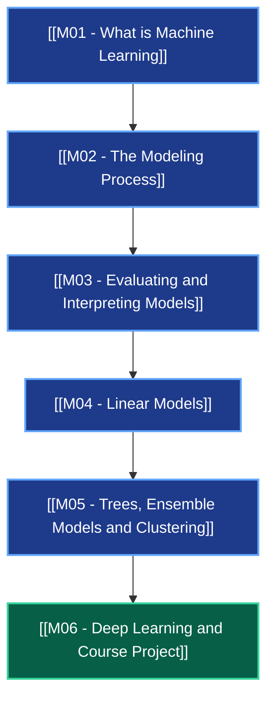

# 🧠 MOC: Machine Learning Foundations for Product Managers

> **Universidad de Duke** | Instructor: **Jon Reifschneider**
> Especialización en Gestión de Productos de Inteligencia Artificial (AI Product Management).

---

## 🗺️ Mapa de Navegación del Grafo

---

## 📚 Módulos del Curso

| Módulo | Título | Lecciones | Conceptos Clave | Estado |
| :--- | :--- | :---: | :--- | :---: |
| **[[M01 - What is Machine Learning]]** | Fundamentos y Límites de ML | 10 | [[Paradigma de Machine Learning]], [[Correlacion vs Causalidad en ML]] | ✅ 100% |
| **[[M02 - The Modeling Process]]** | Ciclo de Vida de Ciencia de Datos | 8 | [[El Ciclo de Vida de Ciencia de Datos]], [[Feature Engineering]] | ✅ 100% |
| **[[M03 - Evaluating and Interpreting Models]]** | Evaluación y Diagnóstico | 8 | [[Overfitting y Bias-Variance Tradeoff]], [[Matriz de Confusion Precision y Recall]] | ✅ 100% |
| **[[M04 - Linear Models]]** | Modelos Lineales y Regularización | 6 | [[Modelos Lineales y Regresion]], [[Regularizacion L1 y L2]] | ✅ 100% |
| **[[M05 - Trees, Ensemble Models and Clustering]]** | Ensembles y Clustering | 8 | [[Random Forest y Gradient Boosting]], [[K-Means Clustering y Segmentacion]] | ✅ 100% |
| **[[M06 - Deep Learning and Course Project]]** | Deep Learning y Proyecto Final | 8 | [[Deep Learning y Redes Neuronales]], [[Diseno de Arquitecturas de Producto con IA]] | ✅ 100% |

---

## ⚡ Acceso Rápido a Índices Maestros

* 📊 **[[KST Prerequisite Graph]]**: Visualización del grafo formal de dependencias de conocimiento.
* 📋 **[[Indice de Reglas de Decision PM]]**: Catálogo de heurísticas y reglas de negocio para Product Managers.
* 🎯 **[[Compendio de Retos Feynman]]**: Banco de casos y evaluaciones socráticas anti-alucinación.
* 📜 **[[Indice de Transcripts Verbatim]]**: 48 lecciones palabra por palabra con anclas `[mm:ss]`.
